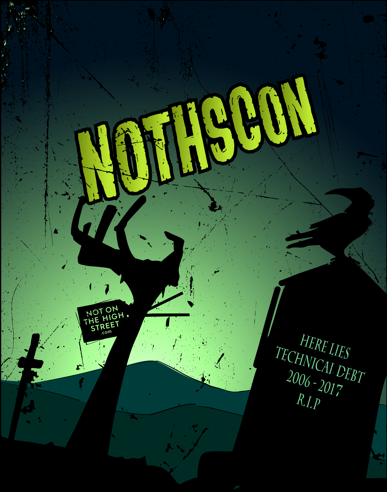

<!-- $theme: default -->
<!-- footer: 01 :: Finding the balance between quality and delivery-->
<!-- page_number: true -->

# Title and Abstract

## Title
* Keep it short and punchy, describe what the talk is about

## Abstract
* 2 paragraphs
* Describe what you are going to talk about and what you want people to leave with

## Finish this by Wednesday lunch time and upload to github


---
# Content

* Keep it simple
* Keep it company agnostic, try to create your slides and talk for someone else to present
* Make it fun but factual
* Your talk should be 30 minutes + 10 minutes Q&A


---

# Use HTML in your slides
```

```


---
# Awesome slides for my talk
*   Please use Marp [https://yhatt.github.io/marp/](https://yhatt.github.io/marp/)
*   Think about imagery if we are open sourcing this may or may not be a problem


---
# Q&A
* Try to keep generic instead of NOTHS specific
* Repeat the question which was asked in order for it to be recorded on video

---
# Don't Panic
*   You will be awesome
*   We will love your talk
*   We appreciate your effort




---
# Awesome slides for my talk
*   Please use Marp [https://yhatt.github.io/marp/](https://yhatt.github.io/marp/)
*   Think about imagery if we are open sourcing this may or may not be a problem
