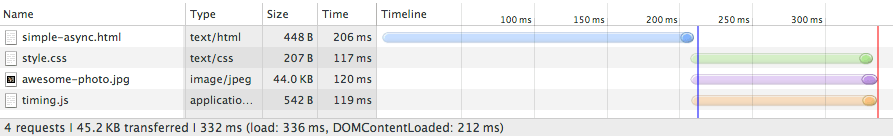
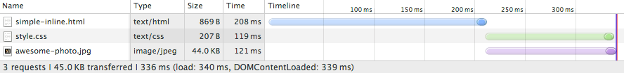

<!-- $theme: default -->
<!-- footer: 04 :: Web 101, critical render path, speed and performance-->
<!-- page_number: true -->

# Web 101:
# The critical rendering path
## Rob Jones

---


# Content 
- How the web browser works
- The critical rendering path
- Optimising the critical rendering path
- Measuring the critical rendering path
- Case study
- Summary 

---

# How the web browser works
 - You visit a web page
 - Your web browser asks for a resource from a server
 - An HTML file is returned
 - Then what?

---


---


---

## How the browser loads resources

An adaptation on a great Google article
<a style="font-size:15px; text-decoration:underline;" href="https://developers.google.com/web/fundamentals/performance/critical-rendering-path/analyzing-crp">Found here</a>

---

## A very basic web page
```
<html>
  <head>
    <title>Basic web page</title>
  </head>
  <body>
    <h1>Our web page.</h1>
    
  </body>
</html>
```

---

## DevTools


 - Events: DOMContentLoaded & OnLoad
 - Resource requests 

---

## Images:


 - Non-parser blocking
 - Non-render blocking

---

## Javascript:


 - Parser & render blocking
 - It might change the DOM or query the CSSOM

---

## CSS:


 - Render blocking
 - DOMContentLoaded still blocked due to JS 

---

## Async/Defer JS:

```
<script src="timing.js" defer></script>
```



 - Not blocking
 - Async blocks the parser to execute when it's loaded
 - Defer waits for parser to finish before executing

---

## Inline JS


 - DOMContentLoaded event fires after `styles.css` is loaded?

---

## Inline JS and CSS


 - Still render and parser blocking
 - Fewer network requests & less load time

---

# Common performance considerations:
 - Place all CSS at the top of your page

 - Async JS if possible
 - If not, place JS at the bottom of your page

 - Bundle CSS, JS, image files (sprites) for fewer network requests
 - Inline JS/CSS where possibly, again fewer network calls
 - Optimise images
 - Minify and Gzip all files

---

# But this isn't enough!

---

# Web pages are getting heavier:<br/>richer media, more features

---

# Users are more demanding
> Usability studies show that after one second with no response, there's a mental context switch in our brains

---

# Introducing the critical rendering path (CRP)

The path/time taken to first render content to a user
Not the whole page just the content above the browser fold
### aka 'First meaningful paint'

---

<image src="images/above-fold-2.png">

---

# Why I like it
It's a user-centred approach to measuring page performance

---

# CRP speed is important!
 - ## Users love it<br/><p style="color:grey; font-size:25px;">The perceived page load is lightening fast meaning higher engagement, more pages viewed, improved conversion</p>
 - ## SEO favours it<br/><p style="color:grey; font-size:25px;">Google's Speed Index metric uses it for boosting</p>

---

# Optimising the critical rendering path
## In 4 steps:

---

# 1.) Minimise number of critical resources
 - Separate the JS and CSS needed to render the above above-the-fold content
 - Async or defer the remaining JS and CSS
 - Leverage Media types and media queries to make CSS non-render blocking
 
 ```
   <head>
     <link href="styles.css">
     <link href="print.css" media="print" >
   </head>
```
 - Async/defer webfonts
 - Utilise client-side caching
 
---

# 2.) Optimise the number of critical bytes
 - Keep your HTML under 14kb
 	###### Due to  TCP behaviour the server can send up to 14KB (first roundtrip) before it waits for the client to acknowledge to deliver more.
  - Defer extra HTML content using JS
  - Use image progressive rendering
  - Inline critical CSS and JS needed for first render

---

# 3.) Optimise the order in which the remaining critical resources are loaded
 - Download all critical assets as early as possible to shorten the critical path length.

---

# 4.) Optimise infrastructure
 - Use low-latency web hosting
 - Put resources on a CDN
 - Optimise caching

---

# Measuring
 - It's hard to know when exactly all above-the fold only content has loaded
 - Tools good for measuring the critical rendering path:
 - <a href="https://developers.google.com/web/tools/lighthouse/">Lighthouse - Chrome extension</a>
- <a href="https://www.webpagetest.org/">WebPagetest - browser based tool</a> 

---

# Measuring part II

Eyeball it using Chrome Devtools:


 ###### Although Google's own docs state:
 > DevTools is currently not well-suited for CRP analysis

---

# Measuring part III
What counts as above-the-fold?
What do you consider critical?

---

# Case study
## How we optimised the CRP of<br/>Notonthehighstreet's Homepage

---

# Objective:
## noths.com to load all above-the-fold content

---

# in ~1 second
###### Currently sits between 1.6 - 1.8 seconds

---

# on 3G

---

# What we measured
<image src="images/noths.png" />

---

# Things to consider:
* Homepage only
* 3G throttling
* On desktop
* No feature loss
* Measured using screen captures
* Running in Dev
	* No initial network latency for HTML considered
	* No initial server time or database reads
	* No caching
	* Similar to if the page were cached or on CDN?
* Simply: how will client-side tweaks affect CRP?

---

## The base metric
<pre style="font-size:14.9px; color:grey;">0         <span style="color:blue;">1</span>                                                                                         10
|.........<span style="color:blue;">|</span>..........................................................................................|
|.........<span style="color:blue;">|</span>......................................................<span style="color:red;">| 6.5</span>
</pre>
# 6.5 seconds
###### Amazon, Notonthehighstreet, Etsy: 8.0 - 10.0 seconds (production)

---

## Move all JS
 - Move non-critical JS below CRP (In our case, all JS)
 - 6 inline scripts and 4 external JS resources
<pre style="font-size:14.9px; color:grey;">0         <span style="color:blue;">1</span>                                                                                         10
|.........<span style="color:blue;">|</span>..........................................................................................|
|.........<span style="color:blue;">|</span>......................................................| 6.5
|.........<span style="color:blue;">|</span>................................................<span style="color:red;">| 5.9</span>
</pre>
# 5.9
###### This Included: error tracking and analytics<br/>which were deferred until above-fold-content was rendered

---

## Remove repeated mobile only HTML
 - Design our layouts better

<pre style="font-size:14.9px; color:grey;">0         <span style="color:blue;">1</span>                                                                                         10
|.........<span style="color:blue;">|</span>..........................................................................................|
|.........<span style="color:blue;">|</span>......................................................| 6.5
|.........<span style="color:blue;">|</span>................................................| 5.9
|.........<span style="color:blue;">|</span>..............................................<span style="color:red;">| 5.7</span>
</pre>
# 5.7

---

## Remove lazy loading from images above fold
<pre style="font-size:14.9px; color:grey;">0         <span style="color:blue;">1</span>                                                                                         10
|.........<span style="color:blue;">|</span>..........................................................................................|
|.........<span style="color:blue;">|</span>......................................................| 6.5
|.........<span style="color:blue;">|</span>................................................| 5.9</span>
|.........<span style="color:blue;">|</span>..............................................| 5.7
|.........<span style="color:blue;">|</span>......................................<span style="color:red;">| 4.9</span>
</pre>
# 4.9
###### Note: gains here also due to moving JS

---

## Move fonts below critical rendering path
 - 3 fonts
 - Progressive enhancement
 - Good use case for client-side caching
<pre style="font-size:14.9px; color:grey;">0         <span style="color:blue;">1</span>                                                                                         10
|.........<span style="color:blue;">|</span>..........................................................................................|
|.........<span style="color:blue;">|</span>......................................................| 6.5
|.........<span style="color:blue;">|</span>................................................| 5.9
|.........<span style="color:blue;">|</span>..............................................| 5.7
|.........<span style="color:blue;">|</span>......................................| 4.9
|.........<span style="color:blue;">|</span>..................................<span style="color:red;">| 4.5</span>
</pre>
# 4.5

---

## Move non-critical CSS
 - Inline critical CSS from 3 files
 - Defer loading the rest of the CSS
<pre style="font-size:14.9px; color:grey;">0         <span style="color:blue;">1</span>                                                                                         10
|.........<span style="color:blue;">|</span>..........................................................................................|
|.........<span style="color:blue;">|</span>......................................................| 6.5
|.........<span style="color:blue;">|</span>................................................| 5.9
|.........<span style="color:blue;">|</span>..............................................| 5.7
|.........<span style="color:blue;">|</span>......................................| 4.9
|.........<span style="color:blue;">|</span>..................................| 4.5
|.........<span style="color:blue;">|</span>.......<span style="color:red;">| 1.8</span>
</pre>
# 1.8

---
### Defer loading of non-visible HTML
 - Use JS to load above-the-fold non-visible HTML
 - Mega-drop-down & departments drop down
<pre style="font-size:14.9px; color:grey;">0         <span style="color:blue;">1</span>                                                                                         10
|.........<span style="color:blue;">|</span>..........................................................................................|
|.........<span style="color:blue;">|</span>......................................................| 6.5
|.........<span style="color:blue;">|</span>................................................| 5.9
|.........<span style="color:blue;">|</span>..............................................| 5.7
|.........<span style="color:blue;">|</span>......................................| 4.9
|.........<span style="color:blue;">|</span>..................................| 4.5
|.........<span style="color:blue;">|</span>.......| 1.8
|.........<span style="color:blue;">|</span>.......<span style="color:red;">| 1.8</span>
</pre>
# 1.8

---

```
<html>
  <head>...</head>
  <body>
    <style>All our inline styles needed for CRP</style>
    <div>All our above-fold content</div>
     
    <link href="styles.css">
    <div>Rest of our HTML</div>
  </body>
</html>
```

---

```
<html>
  <head>...</head>
  <body>
    <style>All our inline styles needed for CRP</style>
    <div>All our above-fold content</div>
     
    <!-- OnLoad fetch JS that builds rest of DOM -->
    <!-- fetch all other resources -->
    <script src="script.js" defer></script>
  </body>
</html>
```

---

## Defer all non-critical resources
 - CSS and JS 
 - Images and fonts
 - We also minified our HTML to get the packet size down to 13kb

# Did it work...
---

# ...no!

<pre style="font-size:14.9px; color:grey;">0         <span style="color:blue;">1</span>                                                                                         10
|.........<span style="color:blue;">|</span>..........................................................................................|
|.........<span style="color:blue;">|</span>......................................................| 6.5
|.........<span style="color:blue;">|</span>................................................| 5.9
|.........<span style="color:blue;">|</span>..............................................| 5.7
|.........<span style="color:blue;">|</span>......................................| 4.9
|.........<span style="color:blue;">|</span>..................................| 4.5
|.........<span style="color:blue;">|</span>.......| 1.8
|.........<span style="color:blue;">|</span>.......| 1.8
|.........<span style="color:blue;">|</span>....<span style="color:red;">| 1.5</span>
</pre>
# 1.5 seconds

---

## 4G
# 0.8 seconds
###### From 5.0

---

## No throttling
# 0.7 seconds
###### From 1.7

---

### 3G results:
# 6.5 => 1.5 seconds
# <p style="color:green">-77%</p>

---

# Summary
 - CRP has to be designed upfront
 - Above-the-fold driven design
 - Evaluate your sites above-the-fold content
 - Making performance gains is addictive

---

# Look for the big winners
- Split CSS & JS into critical and non-critical
- Defer loading of all other resources
- Optimise or progressively enhance images

---

# Other considerations
 - JS frameworks like react
 - css pre-processors like Less or Sass
 - Bundling managers like webpack
 - http://jonathancreamer.com/advanced-webpack-part-2-code-splitting/

---

# What's next for CRP
 - HTTP2 - multiplexing
 - Service workers - super fast offline cache

---

# Want to know more?

<a href="https://developers.google.com/web/fundamentals/performance/critical-rendering-path/analyzing-crp">CRP explained in depth</a>


<a href="https://medium.com/@luisvieira_gmr/understanding-the-critical-rendering-path-rendering-pages-in-1-second-735c6e45b47a#.5h6va2bue">Page rendering in 1 second</a>


<a href="https://hackernoon.com/10-things-i-learned-making-the-fastest-site-in-the-world-18a0e1cdf4a7#.k2ks9qerj">10 things I learned making the fastest site in the world</a>


<a href="https://developers.google.com/web/fundamentals/performance/rail">RAIL performance model</a>


<a href="https://andydavies.me/blog/2013/10/22/how-the-browser-pre-loader-makes-pages-load-faster/">Speculative loading</a>

---