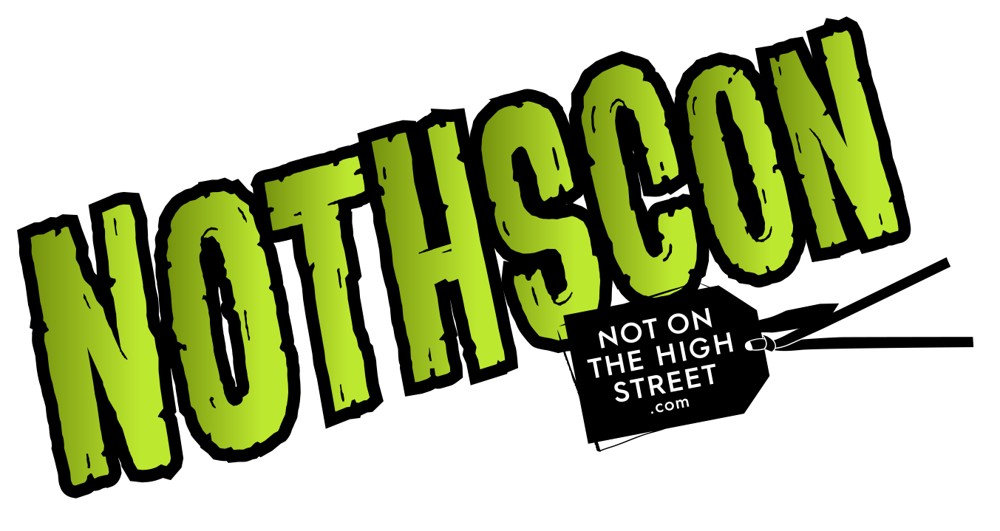

<!-- $theme: default -->
<style>
aside::before { 
    content: "Speaker notes:";
    font-weight: bold;
}
aside {
    width: 850px;
    border: 1px black solid;
    padding: 5px 5px 5px 5px;
    font-size: 12px;
    line-height: 15px;
    background-color: #EFEFEF;
    position: absolute;
    display: none;
    bottom: 15px;
}
</style>
<!-- footer: 01 :: Practical Application Security-->
<!-- page_number: true -->

# Application Security

## Abstract

We'll be exploring some of the principles of Secure Application Development over the next 30 minutes.
## Andrew Millar
### Information Security Specialist



<aside>
Andrew is away but will be presenting this talk telepathically. Anyone who believes in telepathy and telekinses, raise my hand!
</aside>

---
# Application Security

## Abstract

We'll be exploring some of the principles of Secure Application Development over the next 30 minutes.
## ~~Andrew Millar~~
### ~~Information Security Specialist~~
## Nic Jackson
### Java developer ;-)


---
# What is Security?

<aside>
App security is a huge topic, but I hope to cover the basics in this talk.
Before we dive into secure development, lets first describe what security is
To quote Justin Schuh, An Engineer on the Google Chrome Security Team
</aside>


---
# What is Security?

<aside>
Similar to your own personal health, security needs ongoing maintenance and upkeep. There is no, one single thing you can do and then call something secure - it takes on going work and upkeep to call something secure. One cannot call oneself fit after going to the gym once - it take persistence and hard work. Even then, it still might not be 100% secure but the distinction is you've done all that you reasonably can to make it secure.
</aside>

> security is an *_emergent property_* of your overall product or system health. It's not an isolated feature that gets shipped and is then relegated to minor upkeep


---

# So what is Secure Application Development

To borrow Justin's analogy:

> The superior doctor prevents sickness. The mediocre doctor attends to impending sickness. The inferior doctor treats actual sickness.

<aside>
We ain't doctors, we're developers but the idea is the same. We want to prevent _"sickness"_ in our applications. 
</aside>


---
# Why should we care?
<aside>
as crucial as maintaining a secure environment is, applications often are not being designed and developed with security in mind.

Companies have information assets. In order to maintain  our competitive
advantage, we must protect those assets. They've got to be shared carefully and intelligently with customers, business partners, and employees

We need to protect our assets from threats that might cause harm to the company, be it financial loss, reputational damage, loss of confidence or even regulatory fines
</aside>


---
# The purpose of Secure Application Development

To contribute to our business's mission through not only developing the features and business logic we require, but also in protecting our assets by implementing appropriate safe guards for them


---
# The Foundation of Information Security
## Introducing the **CIA**

<aside>
Information Security is founded on three basic premises, does anyone know what they are?
</aside>


---
# Introducing the CIA

* **C**onfidentiality


---
# Introducing the CIA

* **C**onfidentiality - only allowing access to data to which the user is permitted


---
# Introducing the CIA

* **C**onfidentiality - only allowing access to data to which the user is permitted
* **I**ntegrity


---
# Introducing the CIA

* **C**onfidentiality - only allowing access to data to which the user is permitted
* **I**ntegrity - ensuring data is not tampered with or altered by unauthorized users


---
# Introducing the CIA

* **C**onfidentiality - only allowing access to data to which the user is permitted
* **I**ntegrity - ensuring data is not tampered with or altered by unauthorized users
* **A**vailability


---
# Introducing the CIA

* **C**onfidentiality - only allowing access to data to which the user is permitted
* **I**ntegrity - ensuring data is not tampered with or altered by unauthorized users
* **A**vailability - ensuring systems and data are available to authorized users when they need it
 
<aside>
Availability is often not seen as a security concern, but it really is. As a specific example, OCSP (Online Certificate Status Protocol) is the replacement for Certificate Revocation Lists which grew too large to be of any use - by the time you finished downloading a CRL, it was out of date. OCSP allows for example, browsers to check if a certificate is still trustworthy or not. If the OCSP service is unavailable, the browser can't be sure if the cert is trustworthy. What happens then? Does it continue anyway with a potentially compromised certificate, or does it fail hard and deny service to the user. Most browsers do the former.

In a much more general sense, the security of a business depends on its systems being available. The future of an ecommerce site for example, will not be very certain if its systems are down and customer can't buy things.
</aside>


---
# Protecting the Foundation
<aside>
So how do we protect our Foundation?
</aside>


---
# Protecting the Foundation
<aside>
Every feature added to an application adds a certain amount of risk to the overall system. The aim for secure development is to reduce the overall risk by reducing the attack surface area.

For example, say a web application enhances their online help with a search function. 
Might be vulnerable to SQL injection attacks. 

If limited to authorized users, the likelihood of attack is reduced. 

If search function was gated through centralised data validation routines, the attack surface for SQL injection is dramatically reduced.

However, if the whole help feature was re-written to eliminate the need for search function (through better user interface, for example), this practically eliminates the attack surface area all together.
</aside>

* Minimize attack surface area


---
# Protecting the Foundation
<aside>
least privilege recommends that accounts, services etc have the least amount of privilege required to perform their business processes. This encompasses user rights and resource permissions such as CPU limits, memory, network access, and file system permissions.
</aside>

* Minimize attack surface area
* Least Privilege


---
# Least Privilege gone wrong
## CVE-2016-1247

> Nginx web server packaging on Debian-based distributions such as Debian or Ubuntu was found to create log directories with insecure permissions which can be exploited by malicious local attackers to escalate their privileges from nginx/web user (www-data)

<aside>
The problem was simply that the user nginx runs as (www-data in this case) could *write* to the Nginx error log. Nginx usually keeps a privileged process running to write logs, bind to port &lt; 1024, so there is no need for the www-data user to have write permission to the log files.
</aside>


---
# CVE-2016-1247 Demo
  <link rel="stylesheet" type="text/css" href="asciinema-player.css" />
 <asciinema-player src="njinxed.json"></asciinema-player>
   <script src="asciinema-player.js"></script>
<aside>
Back up PoC link: https://operationnotpermitted.com/static/njinxed.html

This vulnerability was found and POC written by Dawid Golunksi of legalhackers.com.
We copy /bin/bash to /tmp and compile a shared library to chown our tmp bash to root and setuid.
delete the error log and symlink it to ld.preload.so. Logrotate kicks in around 6 am and reloads nginx after rotating the logs. 

Nginx recreates the error log, following the symlink to ld.preload.so. This ends up being created and owned by www-data. 

Now we add our library to ld.preload, call a setuid binary such as sudo (to run something as root), this loads our library and changes the permissions of our tmp bash, then we just run our tmp bash. 

---
# Protecting the Foundation
<aside>
This is the idea that more is better, where one control would be a good thing, more controls that approach the risk from a different angle are better.

Defense in Depth often looks like Tier-Based control, for instance you might validate and sanitise user-supplied data before storing it in the database. An additional control would be html encoding that user-supplied data when its read back from the database.</aside>

* Minimize attack surface area
* Least Privilege
* Defense in Depth


---
# Protecting the Foundation
<aside>
The default experience of a system should be secure and it should be up to the user to reduce their security (if they're allowed to that is)
</aside>

* Minimize attack surface area
* Least Privilege
* Defense in Depth
* Secure Defaults


---
# Protecting the Foundation
<aside>
Apps fail and bork all the time, but _how_ they fail can affect whether an application is secure or not. Take the following example:
</aside>

* Minimize attack surface area
* Least Privilege
* Defense in Depth
* Secure Defaults
* Fail Securely


---
# Fail Securely Fail
### Stolen from OWASP

<link rel="stylesheet" type="text/css" href="prism.css" />
   <script src="prism.js"></script>

```js
isAdmin = true;
try {
  codeWhichMayFail();
  isAdmin = isUserInRole( “Administrator” );
}
catch (Exception ex) {
  log.write(ex.toString());
}
```
<aside>
If either codeWhichMayFail() or isUserInRole fails or throws an exception, the user is an admin by default. This is obviously a security risk.
</aside>


---
# Protecting the Foundation
<aside>
Fairly self-explanatory.

Certain roles have different levels of trust than normal users. In particular, administrators are different to normal users. In general, administrators should not be users of the application.

For example, an administrator should be able to turn the system on or off, set password policy but shouldn’t be able to log on to the storefront as a super privileged user, such as being able to “buy” goods on behalf of other users.
</aside>

* Minimize attack surface area
* Least Privilege
* Defense in Depth
* Secure Defaults
* Fail Securely
* Separation of duties


---
# Protecting the Foundation
<aside>
Attack surface area and simplicity go hand in hand. 

Avoid complex architectures when something simpler would be faster and easier. Avoid double-negatives, they aren't unnatural.
</aside>

* Minimize attack surface area
* Least Privilege
* Defense in Depth
* Secure Defaults
* Fail Securely
* Separation of duties
* Keep it Simple


---
# Protecting the Foundation
<aside>
Having a clear audit trail of what happened is crucial to security, especially when performing forensics. With out an audit trail, the answer to "What happened?" is "We don't know". Not a great position to be in
</aside>

* Minimize attack surface area
* Least Privilege
* Defense in Depth
* Secure Defaults
* Fail Securely
* Separation of duties
* Keep it Simple
* Maintain an audit trail


---
# A good Audit Trail

Answers:
* Who
* What
* When
* Why
* How


----
# Audit Fail

<aside>
This is an example of an authentication failure log message from an app at a previous exmployer. It isn't much use - which user failed authentication?!
</aside>
```plain
Aug 18 11:00:57 [AuthController] Authentication failed.
```


----
# Audit Win

<aside>
If we reworded the log message to answer the Who What When Why and where applicable, the How, we get the full picture of what happened. Including contextual information such as URL and referer is also very useful.
</aside>
```plain
Aug 18 11:00:57 [AuthController] Authentication failure 
for andrww@example.com by 127.0.0.1 - user unknown - 
/user/login /user/myaccount
Aug 18 11:01:18 [AuthController] Authentication failure 
for andrew@example.com by 127.0.0.1 - invalid password - 
/user/login?err=1 /user/login
Aug 18 11:02:01 [AuthController] Authentication failure 
for andrew@example.com by 127.0.0.1 - incorrect 2FA code 
- /user/login?err=2 /user/login
```


---
# To recap
<aside>

</aside>

* Minimize attack surface area
* Least Privilege
* Defense in Depth
* Secure Defaults
* Fail Securely
* Separation of duties
* Keep it Simple
* Maintain an audit trail


----
# Audit Win

```plain
Aug 18 11:00:57 [AuthController] Authentication failure 
for andrww@example.com by 127.0.0.1 - user unknown - 
/user/login /user/myaccount
Aug 18 11:01:18 [AuthController] Authentication failure 
for andrew@example.com by 127.0.0.1 - invalid password - 
/user/login?err=1 /user/login
Aug 18 11:02:01 [AuthController] Authentication failure 
for andrew@example.com by 127.0.0.1 - incorrect 2FA code 
- /user/login?err=2 /user/login
```


----
# So where do I start?

<aside>
So now we know _what_ to do, **how** do we do it?
</aside>


----
# So where do I start?


Have a look at:
* The Open Web Application Security Project - https://www.owasp.org
* SANS - https://www.sans.org
	Particulary their Whitepaper on a Framework for Secure Application Design and Development. It's from 2002, but the ideas are still relevent - https://www.sans.org/reading-room/whitepapers/application/framework-secure-application-design-development-842
* Security Analysis tools in your language


---
#  Application Security Testing:
<aside>
Static analysis tools are similar to linters you may already be using, except instead of highlighting syntactical issues, they flag potential security issues. They are very useful tools and you can often integrate the into your IDE and have them run as you code!

Dynamic analysis tools are usually much more involved and time consuming so I'll try to avoid listing any here
</aside>

Much like linters, there are Analysis tools for most languages

For Example:
    Ruby/Rails - [Brakeman](http://brakemanscanner.org/), [Codesake Dawn](https://rubygems.org/gems/codesake-dawn), [Space](https://people.eecs.berkeley.edu/~jnear/space/)
    Java - [Find Security Bugs](http://find-sec-bugs.github.io/) plugin for [FindBugs](http://findbugs.sourceforge.net/), [PMD](https://pmd.github.io/), [Infer](http://fbinfer.com/)
    PHP  - [RIPS](https://sourceforge.net/projects/rips-scanner/)
    Javascript/Node - [scanjs plugin for eslint](https://github.com/mozfreddyb/eslint-config-scanjs), [RetireJS](https://retirejs.github.io/retire.js/)
    C - [Infer](http://fbinfer.com/), [FlawFinder](https://www.dwheeler.com/flawfinder/)
    Go - [SafeSQL](https://github.com/stripe/safesql), [Dingo Hunter](https://github.com/nickng/dingo-hunter), [Go StaticCheck](https://github.com/dominikh/go-staticcheck), [IeffAssign](https://github.com/gordonklaus/ineffassign)


---

# That's all for now folks!

I hope this has been an interesting introduction to the concepts of Secure Application development!


