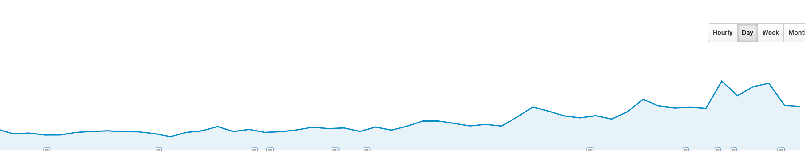

<!-- $theme: default -->
<!-- footer: 12 :: Making Code Fly: Load Testing Web Applications -->
<!-- page_number: true -->

# Making Code Fly: Load Testing Web Applications

## Paul Robinson
### Senior Software Engineer - notonthehighstreet.com

--- 

# What is the purpose of the software we write?

---

# Utility

* End users/customers
	* The people we build the tools for (maybe)
	* Being able to acheive their goal
* Business owners
	* "Monetising value"

Things they care about can include:
* Ease of use
* Features
* Code quality/lack of bugs

---

# Performance?

It matters to customers because we can prove it:
* Higher conversion
* Higher return rates
* Valued more than slower competitors

It matters to business owners because we can prove it:
* All of the customer value
* On the web, the code is not running on customer's hardware, but on the business owner's

It should matter to a developer **because otherwise we are making our product less viable, and we will be fired**

---

# "Premature optimisation is the root of all evil"

Who said this?

---

> "Programmers waste enormous amounts of time thinking about, or worrying about, the speed of noncritical parts of their programs, and these attempts at efficiency actually have a strong negative impact when debugging and maintenance are considered. We should forget about small efficiencies, say about 97% of the time: premature optimization is the root of all evil. Yet we should not pass up our opportunities in that critical 3%."
> 
-- Donald Knuth, "Structured Programming With Goto Statements", 1974

---

# Why 3%?

---

> A good programmer will not be lulled into complacency [...] he will be wise to look at the critical code; but only _after_ that code has been identified. It is often a mistake to make a priori judgements about what parts of a program are really critical, since the universal experience of programmers who have been using measurement tools has been that that their intuitive guesses fail.
> 
-- Donald Knuth, "Structured Programming With Goto Statements", 1974

---

# The Web is different

1. We are quite often IO-bound, and our performance is basically a measure of responding to every input with the correct output as quickly as mechanically possible
2. Every request/response cycle is in essence "the inner loop" that makes up the majority of the application performance that we care about.

---

# What might our "inner loop" be?

* Parsing and validating user input
* Constructing and executing lookups in data stores (e.g. SQL)
* Parsing the output of those lookups
* Cache management/invalidation - I have seen parts of applications that spends more time calculating cache keys than they do anything else in the request
* Rendering a result into JSON or HTML

---

# APM

* End user experience monitoring – (active and passive)
* Application runtime architecture discovery and modelling
* User-defined transaction profiling (also called business transaction management)
* Application component monitoring
* Reporting & Application data analytics

---

---

# An example

---

# What are we looking at?

1. A customer's web browser will look up the DNS records for the domain.
2. load balancer -> an internal gateway service -> routes traffic to an application instance
3. The application looks at request, and determines which piece of code needs to be executed
4. If that code has some cacheable components, cache keys are calculated, and a cache lookup is made.
5. On a cache miss, we go and talk to the data stores, run some business logic, do whatever the request is meant to do
6. Build a response in HTML/JSON/XML
7. Optionally populate caches so the next request can skip steps 5 and/or 6 next time
8. Throw that response back to the user's client

---

# External dependencies

Caching is not the answer:

1. Cache keys can be expensive to calculate
2. Your cache might not be as fast as you think

---

# Memcache contention

---

# Network contention - enough instances?

---

# Load Testing

## Do you need a production like environment?

Yes, but maybe not.

---

---

# Getting produciton traffic

* Google Analytics (via API)
* Server logs
* Making it up?

The important thing is it should be representative if possible

---

# Running Load tests

* JMeter
* Flood.io
* Metrics in your environment
	* New Relic
	* Datadog
	* ...

It's critical to be able to compare your test results to your production data in a way that is meaningful

---

# Hang on, can't I just use a CDN?

### No. Well, maybe.

---

# Testing CDNs is hard

* DNS lookups will cluster based on geo of grid
* It doesn't tell you about application performance really
* We can get strange results

---

# Summary

* Performance optimisation is not evil - your job relies on it
* New Relic & Datadog
* You don't need perfect production clones to get meaningful results
* Get real traffic profiles
* JMeter & Flood.io
* CDNs are not magic

---

# Thank you
