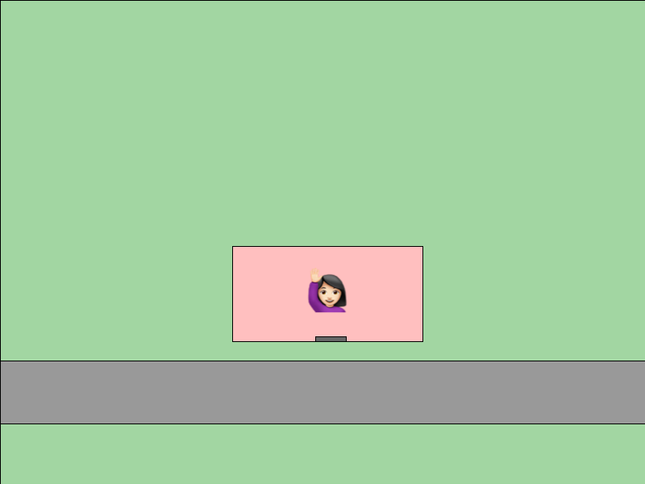
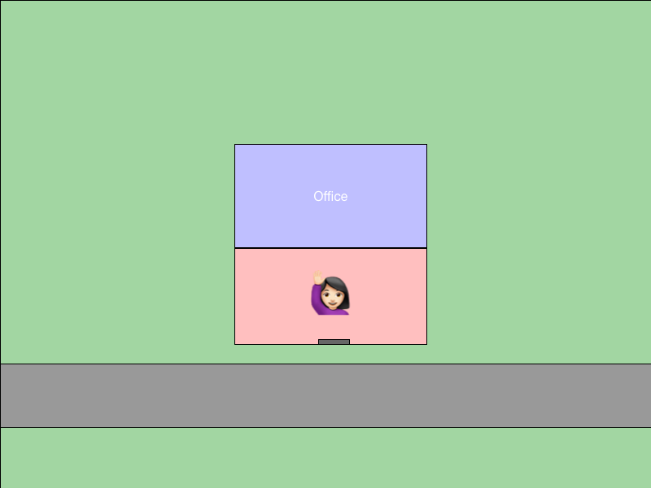
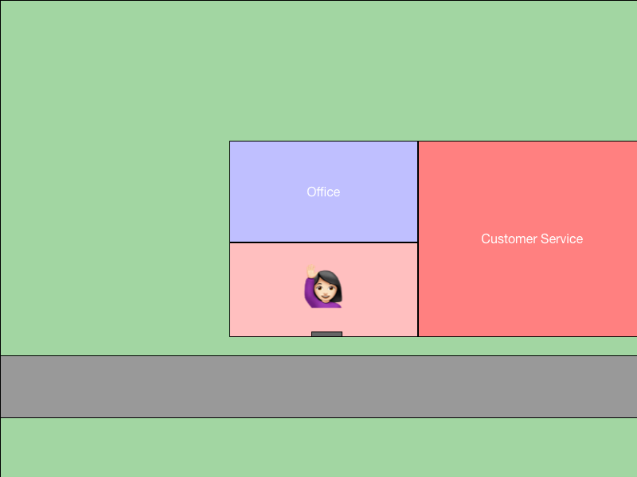
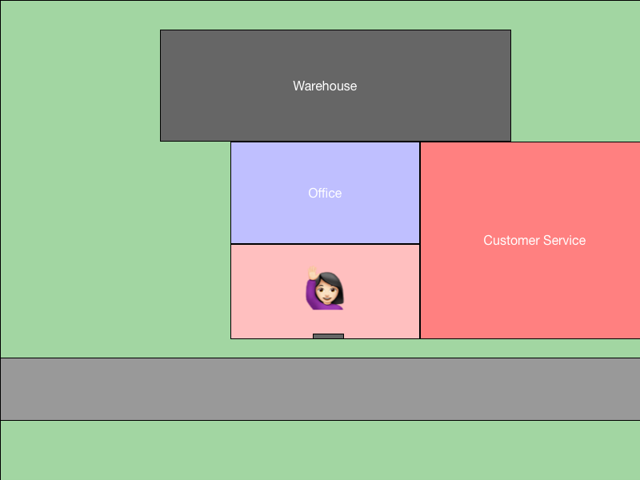
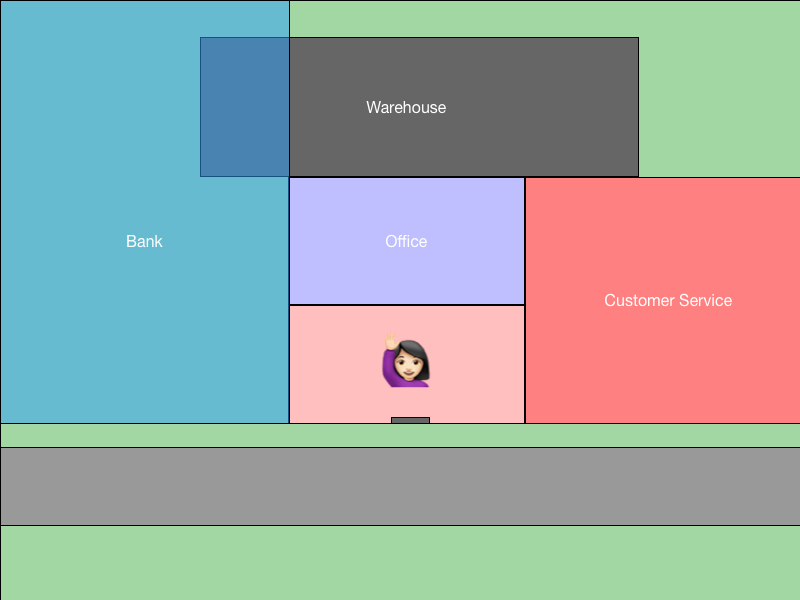
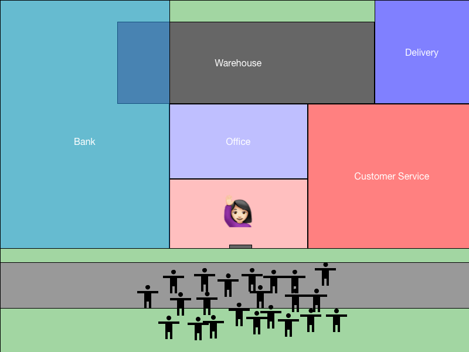
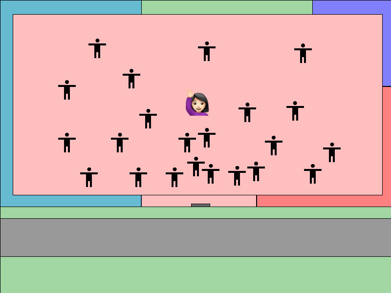
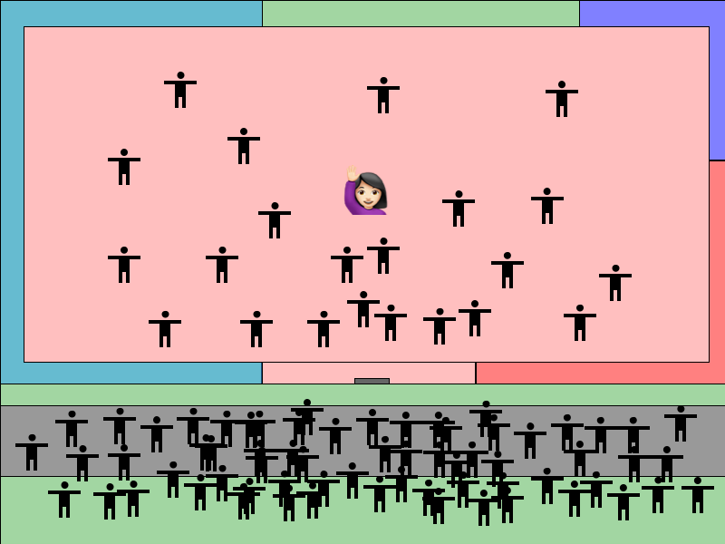
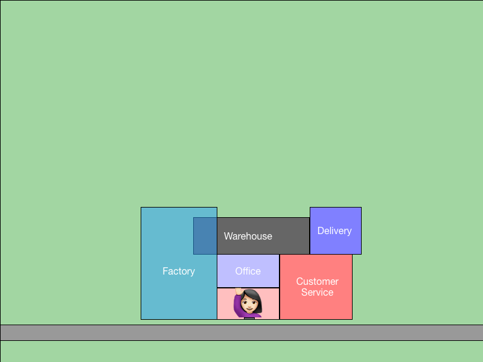
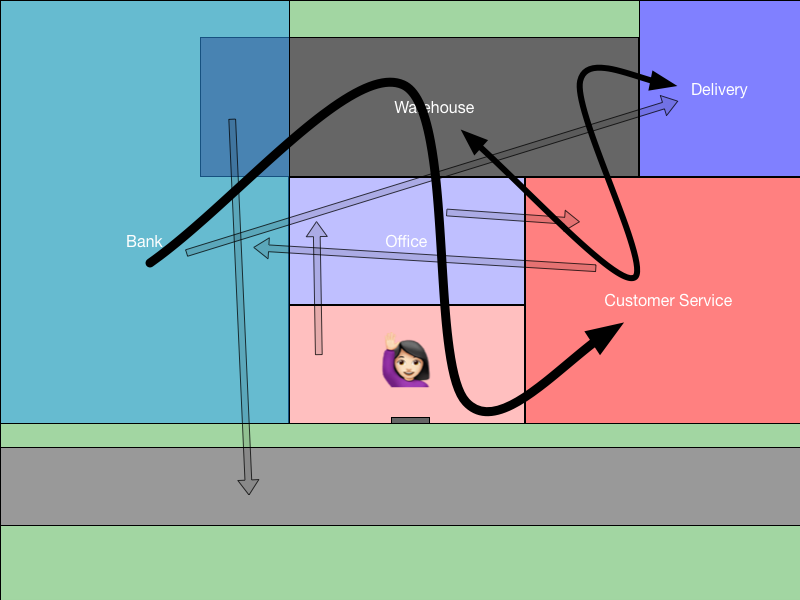

<!-- $size: 16:9 -->

# Breaking Down the Monolith
### Why bother?

---

## Meet Linda and her successful business.

---

## User accounts, catalogues, payments, etc.
---

---

## Cheaper to keep goods closeby

---

## Consumer credit is cheap, what the heck!

---

## This courier service is too expensive!

---

## More space! Franchising!

---

## Disaster!

---

---

## Lesson learned. We are going to build micro-shops.

---

### Welcome to the team. Your job is to untangle this. Zero downtime allowed.

---

## Delivery

* Orders are hand delivered by someone from back office.
* They need to walk all the way through the bank to get to you.
* You need to let customer service know when you ship stuff out.
* Right now you shout at Frank over in warehouse to ask about stock levels.
* What's going to happen when you are no longer attached to the building?

---

1. Denial
2. Anger
3. Bargaining
4. Depression
5. Acceptance

---

## Brand new Delivery micro-shop

* Install fax machines that automatically send new orders to the delivery office.
* The warehouse will install a system that lets you query their stock levels. Incidentally this makes them work faster.  (Sadly, this puts Frank out of work).
* You automatically notify customer services when you ship stuff out.

---

## Problem solved?

* Messaging between micro-shops is the biggest immediate hurdle!
* You still need to extract the other parts of the business.
* You need to do all of this without closing any of the shops, ever!

---

# Monolith breakdown is primarily a business problem.
#
### Microservice extraction needs to be driven by business requirements.

---

Q: "We need to be able to serve more users without the site going down"
A: "Let's put the site behind a CDN"
Q: "GeoLocation won't work behind a CDN"
A: "We can build a GeoLocation a microservice"

---

## When should you build a new service?
#
* New features request.
* Existing implementation is too costly.
* Current tech cannot grow anymore.

---

# How?

* Identify the dependencies.
* Try to scope the size of the problem.
* Go have conversations within the business about this problem.
* Come up with a plan and implement the solution.

---
### I dislike doing this stuff.
#
### I'm a developer not a business person.
#
### I want to write code, not have endless conversations about these things.

---

## If you're not in the room then these decisions will be made without you.

---
## This is tough

* This is going to take a while.
* It's going to be difficult.
* Sometimes it will seem like it's not worth it.

---

## You will make more progress
## than you think you are capable of making.

---

## My key takeaways

* Software is hard.  This is an ongoing and iterative change.
* Sometimes it's ok to have more conversations than write code.
* Each solution will throw up new problems.
* The best you can do is to make it a little better every day.