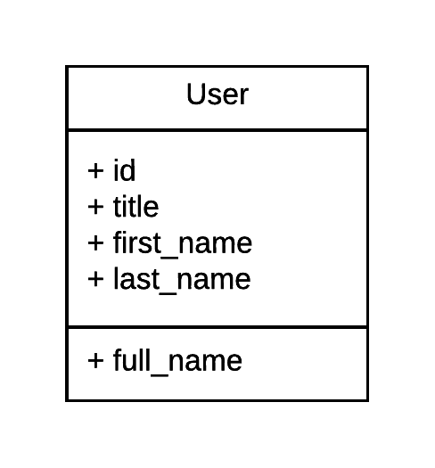
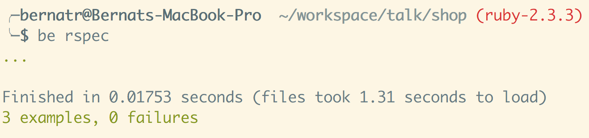
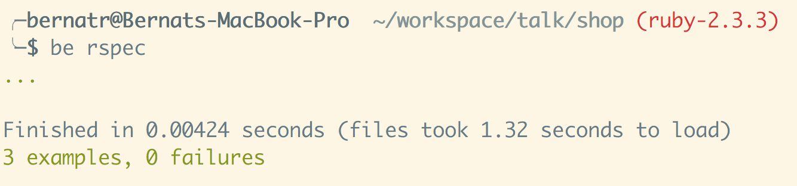
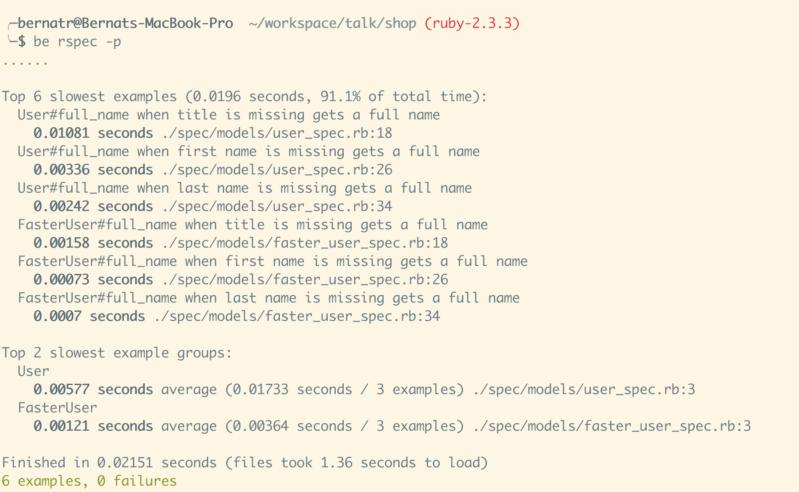
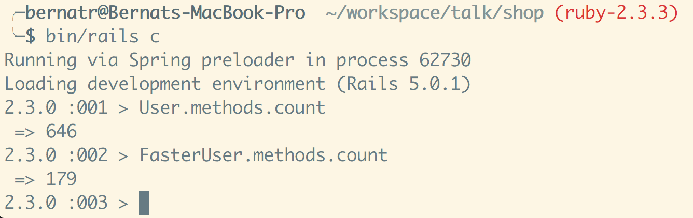
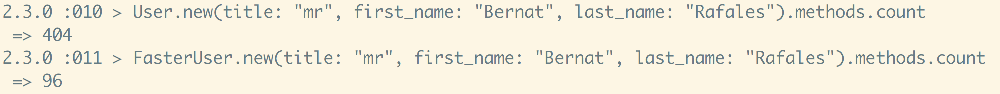
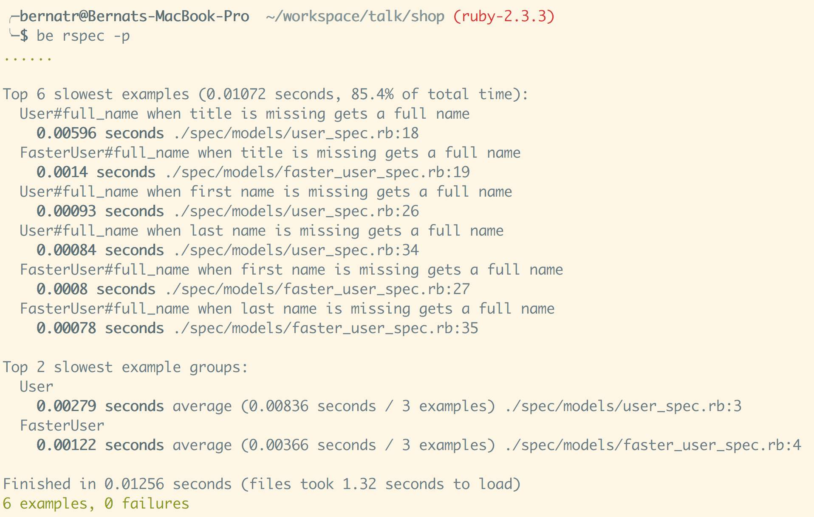
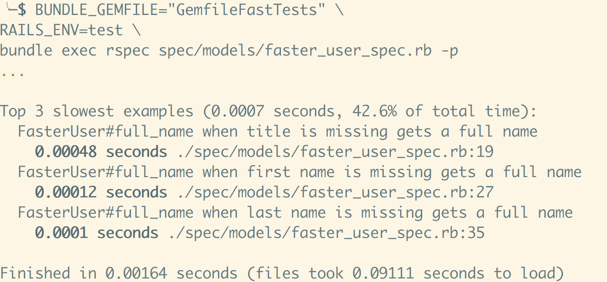
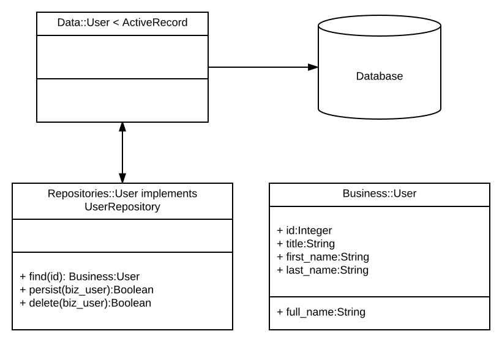

<!-- $theme: default -->
# Mind your own business
### Bernat Rafales
bernatrafales@notonthehighstreet.com
Techical Lead at NotOnTheHighStreet.com
28/02/2017 NOTHSCON

---

# Testing our code
* We have to write tests for our code
* We have to run those tests

---
# We don't always write tests
* We don't know what tests are
* We are lazy
* Our code is very difficult to test, and we give up

---
# Testing Rails Applications
* Some of its design decisions make testing harder
* Rails is still the first development environment for many people

---
# Let's focus on Rails Models
[Active Record was described by Martin Fowler](https://www.martinfowler.com/eaaCatalog/activeRecord.html) in his book Patterns of Enterprise Application Architecture. In Active Record, objects carry both persistent data and behavior which operates on that data. Active Record takes the opinion that ensuring data access logic as part of the object will educate users of that object on how to write to and read from the database.

---
# User model


---

# User class
```ruby
class User < ActiveRecord::Base
  def full_name
    [title, first_name, last_name].compact.join(" ")
  end
end
```

---
# User class test
```ruby
require 'rails_helper'

RSpec.describe User, type: :model do
  let(:title) { "Mr" }
  let(:first_name) { "Foo" }
  let(:last_name) { "Bar" }

  subject do
    described_class.create(title: title,
      first_name: first_name,
      last_name: last_name)
  end
end
```

---

```ruby
describe "#full_name" do
    context "when title is missing" do
      let(:title) { nil }

      it "gets a full name" do
        expect(subject.full_name).to eq("Foo Bar")
      end
    end

    context "when first name is missing" do
      let(:first_name) { nil }

      it "gets a full name" do
        expect(subject.full_name).to eq("Mr Bar")
      end
    end

    context "when last name is missing" do
      let(:last_name) { nil }

      it "gets a full name" do
        expect(subject.full_name).to eq("Mr Foo")
      end
    end
  end
```
  
---
  
# Run the tests


---

# In a world without Rails...
```ruby
class FasterUser
  attr_reader :title, :first_name, :last_name

  def initialize(title:, first_name:, last_name:)
    @title = title
    @first_name = first_name
    @last_name = last_name
  end

  def full_name
    [title, first_name, last_name].compact.join(" ")
  end
end
```

---

```ruby
require 'rails_helper'

RSpec.describe FasterUser do
  let(:title) { "Mr" }
  let(:first_name) { "Foo" }
  let(:last_name) { "Bar" }

  subject do
    described_class.new(title: title,
      first_name: first_name,
      last_name: last_name)
  end
end
```

---

```ruby
describe "#full_name" do
  context "when title is missing" do
    let(:title) { nil }

    it "gets a full name" do
      expect(subject.full_name).to eq("Foo Bar")
    end
  end

  context "when first name is missing" do
    let(:first_name) { nil }

    it "gets a full name" do
      expect(subject.full_name).to eq("Mr Bar")
    end
  end

  context "when last name is missing" do
    let(:last_name) { nil }

    it "gets a full name" do
      expect(subject.full_name).to eq("Mr Foo")
    end
  end
end
```

---

# FasterUser test results



---

# Full test suite results


---

# Difference in speed

|Class|Test Run Time|Times slower|
|-----|:-------------:|-------:|
| User|0.00577s     |4.77x|
|FasterUser| 0.00121s|1x|

---

```ruby
class User < ActiveRecord::Base
  def full_name
    [title, first_name, last_name].compact.join(" ")
  end
end
```
```ruby
class FasterUser
  attr_reader :title, :first_name, :last_name

  def initialize(title:, first_name:, last_name:)
    @title = title
    @first_name = first_name
    @last_name = last_name
  end

  def full_name
    [title, first_name, last_name].compact.join(" ")
  end
end
```
---

# However...



---

```ruby
class User < ActiveRecord::Base
  def full_name
    [title, first_name, last_name].compact.join(" ")
  end
end
```
```ruby
class FasterUser
  attr_reader :title, :first_name, :last_name

  def initialize(title:, first_name:, last_name:)
    @title = title
    @first_name = first_name
    @last_name = last_name
  end

  def full_name
    [title, first_name, last_name].compact.join(" ")
  end
end
```

---

# ActiveRecord User class
* Check class name `User`. Convert it to `users`
* Connect to the database and get schema of the `users` table
* For every column in the table, dynamically create getters, setters and other similar methods.

All of the above has a cost, especially when it involves talking to the database

---

# We can try to optimise our User
```ruby
require 'rails_helper'

RSpec.describe User, type: :model do
  let(:title) { "Mr" }
  let(:first_name) { "Foo" }
  let(:last_name) { "Bar" }

  subject do
    #Use `new` instead of `create`
    described_class.new(title: title,
      first_name: first_name,
      last_name: last_name)
  end
end
```

---

# And the winner is...

The new User test is 2x faster than the old one, but still 2.3x slower than the FasterUser one

---

# But it turns out the FasterUser test can also be optimised!
`(files took 1.47 seconds to load)`

---
```ruby
require 'rails_helper'

RSpec.describe FasterUser do
  let(:title) { "Mr" }
  let(:first_name) { "Foo" }
  let(:last_name) { "Bar" }

  subject do
    described_class.new(title: title,
      first_name: first_name,
      last_name: last_name)
  end
end
```

---

## We don't need any rails classes for our tests

```ruby
#require 'rails_helper'
require 'spec_helper'
require './app/models/faster_user'

RSpec.describe FasterUser do
  let(:title) { "Mr" }
  let(:first_name) { "Foo" }
  let(:last_name) { "Bar" }

  subject do
    described_class.new(title: title,
      first_name: first_name,
      last_name: last_name)
  end
end
```

---

## We only need to load the rspec gem to test our file

```
source 'https://rubygems.org'

gem 'rspec'
```

---



---

Whilst those gains may be in the milliseconds level, when you start having hundreds of ActiveRecord classes, and tens of tests for each one, the difference in time starts to become non negligible

---

# Let's use Plain Old Ruby Objects for everything, shall we...?

---

# Repositories/Data Mapping


---

```ruby
module Business
  class User
    attr_reader :id, :title, :first_name, :last_name

    def initialize(id: nil, 
                   title:, 
                   first_name:, 
                   last_name:)
      @title = title
      @first_name = first_name
      @last_name = last_name
    end

    def full_name
      [title, first_name, last_name].compact.join(" ")
    end
  end
end
```

---

```ruby
module Data
  class User < ActiveRecord::Base
    self.table_name = "users" #override Rails convention
  end
end
```

---

```ruby
module Repositories
  class User
    def initialize(db: Data::User)
      @db = db
    end

    def find(id)
      user_data = @db.find(id)
      user_biz_from_data(user_data)
    end

    def persist(user_biz)
      if user_biz.id.nil?
        create(user_biz)
      else
        update(user_biz)
      end
    end

    def delete(user_biz)
      user_data = @db.find(user_biz.id)
      user_data.destroy
    end
  end
end
```
---

# Using our repository
```ruby
user = Business::User.new(
title: "Mr", 
first_name: "Foo", 
last_name: "Bar")
#<Business::User:0x007fac5fc8a448>
repository = Repositories::User.new
#<Repositories::User:0x007fac5ff10d70>
repository.persist(user) #DB create happens here
#true
bernat = repository.find(3) #DB select happens here
#<Business::User:0x007fac5fb09718>
bernat.full_name
#Mr Bernat Rafales
```

---

# Putting it all together
A new requirement comes in, we need a way to create letters for our users. We have the letter content, and we want to generate a string so we can print the letter with our user's full name in the header

---
# The Rails Way
```ruby
module Services
  class Letter

    def generate(user_id, content)
      #database access and coupling to the User class
      user = User.find(user_id)
      "Dear #{user.full_name}, #{content}"
    end
  end
end
```
In order to test that effectively, we need to either
* Create a user in the database before you run the test, which will make it slow
* Override the User find method so it returns an already in memory user, which is a slippery slope

---

# The Repository way
```ruby
module Services
  class Letter

    def initialize(
      user_repository: Repositories::User.new)
      @user_repository = user_repository
    end

    def generate(user_id, content)
      user = @user_repository.find(user_id)
      "Dear #{user.full_name}, #{content}"
    end
  end
end
```

---

### Testing the new service
```ruby
require "spec_helper"
require './app/services/letter'
RSpec.describe Services::Letter do
  class MyTestUser
    def full_name
      "Mr Nobody"
    end
  end

  class MyTestRepository
    def find(id)
      return MyTestUser.new
    end
  end
  subject do
    described_class.new(
      user_repository: MyTestRepository.new)
  end
  it "generates a letter addressed to a user" do
    expect(subject.generate(1, "have a nice day"))
    .to eq("Dear Mr Nobody, have a nice day")
  end
end
```

---

# Summary
* ActiveRecord is great. Leverage its features
* But consider using it only for the Data Access Layer
* By adding an abstraction layer on top of your data you can make your code and your tests less coupled, easier to write, change and faster to run
* Consider alternatives to Rails
  * https://github.com/rom-rb
  * http://hanamirb.org/
  * https://martinfowler.com/eaaCatalog/dataMapper.html
  * https://martinfowler.com/eaaCatalog/repository.html
  * https://martinfowler.com/eaaCatalog/activeRecord.html

---

Thank you!